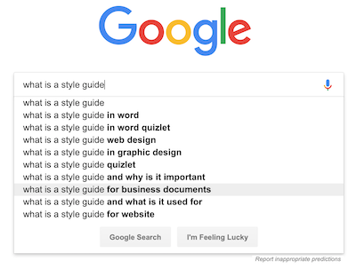
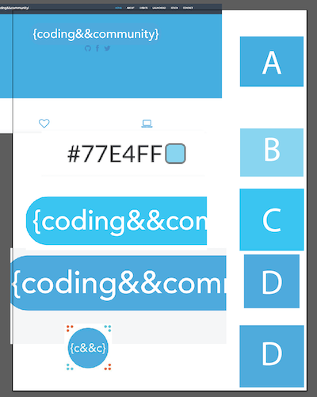
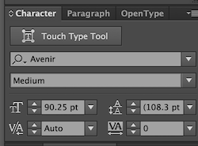
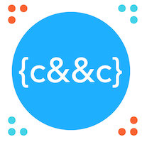
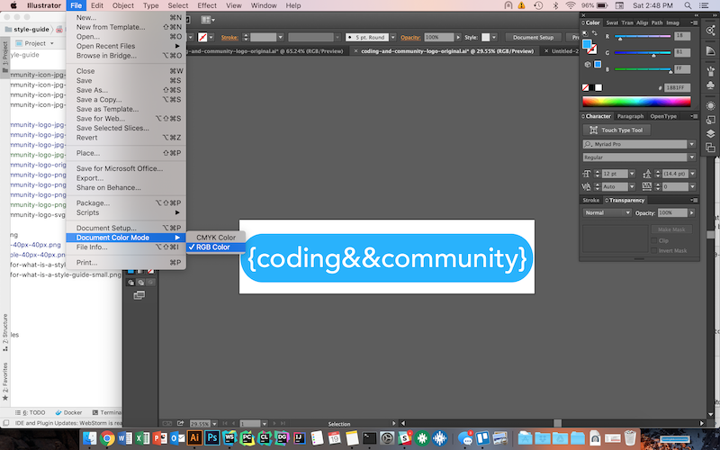
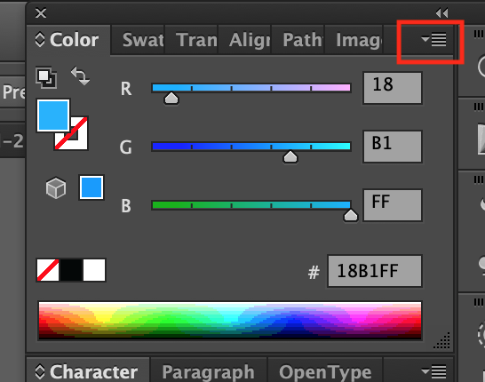
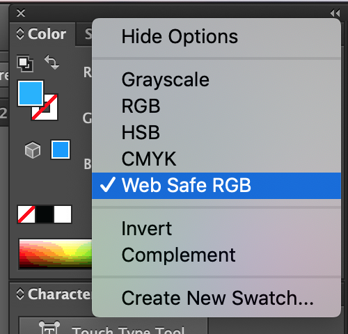

# style-guide
This repository contains the style guide for coding&&community. It should contain all graphic design/brand assets as wells as hex codes for colors and recommended fonts.

Visit [https://codingandcommunity.org](https://codingandcommunity.org) for more information about our organization.

We are a [Rensselaer Polytechnic Institute](https://www.rpi.edu/) [Student Union](https://union.rpi.edu/) Club.

# What is a style guide? #

You're probably only here to copy and paste one picture or value.



When I ran a google search for "what is a style guide," I got the following quote from https://www.executionists.com/website-brand-style-guide/:

> A brand style guide is the primary visual DNA of your company’s branding, though it can also reference grammar, tone, word usage and point of view. Essentially, it’s a document that describes, defines and presents examples of what your brand looks like in various visual media such as print, Internet and broadcast. To be effective it must clearly define the rules around your online presence in all channels such as websites, landing pages, mobile sites, online ads, blogs, social media channels and email communications (including email signatures!).

So, this document contains links to official versions of the coding&&community, names of coding&&community fonts, and hex codes of coding&&community colors.

# Why? Isn't this a lot of effort? #

Well. It all started when I realized we were using at least four different shades of blue to represent our brand. This had to stop. A consistent brand is key to a professional organization.



This style guide will help ensure that we always represent the coding&&community brand in a consistent way.

# Name #

For the purpose of branded material, the name of this organization is `coding&&community` and is styled as such. All letters are lowercase, and two ampersand (`&`) characters are used to separate the word `coding` from the word `community`.

### Exceptions ###

- If entering the name `coding&&community` into a form that does not accept the ampersand (`&`) character, then the name of this organization should be styled as follows: `codingandcommunity`. The two ampersands are replaced with the word `and`, and all letters remain lowercase. For example, our GitHub profile is located at https://github.com/codingandcommunity.

# Colors #

| Name                            | Hex Code | Sample                                                          |
|---------------------------------|----------|-----------------------------------------------------------------|
|coding&&community blue           | 18B1FF   |                     |
|coding&&community secondary blue | 43D2E8   | |
|coding&&community orange         | FF6922   |                 |

# Logo #

The coding&&community logo consists of a blue rounded rectangle containing the text `{coding&&community}` in white text using the `Avenir` font.



The logo is quite wide and should be placed at the top of documents and websites. It should also be used for stickers. It should not be used if the logo must be a square or if width is a major concern. The icon should be used in these cases.


The following table links to copies of this logo in various formats and various sizes:


| Link                                                                                                                                                              | Format            | Compatibility | Width   | Height |
|-------------------------------------------------------------------------------------------------------------------------------------------------------------------|-------------------|---------------|---------|--------|
| [coding-and-community-logo-original.ai](logo/coding-and-community-logo-original.ai)                                                                               | Adobe Illustrator | Adobe Only    | Vector  | Vector |
| [coding-and-community-logo-font-converted-to-outlines.ai](logo/coding-and-community-logo-font-converted-to-outlines.ai)                                           | Adobe Illustrator | Adobe Only    | Vector  | Vector |
| [coding-and-community-logo-svg-vector.svg](logo/coding-and-community-logo-svg-vector.svg)                                                                         | SVG               | Modern Web    | Vector  | Vector |
| [coding-and-community-logo-svg-vector-original-RAW-AVENIR-FONT.svg](logo/coding-and-community-logo-svg-vector-original-RAW-AVENIR-FONT.svg)                       | SVG               | Mac Only      | Vector  | Vector |
| [coding-and-community-logo-png-2000-px-by-333-px.png](logo/coding-and-community-logo-png-2000-px-by-333-px.png)                                                   | PNG               | Universal     | 2000 px | 333 px |
| [coding-and-community-logo-png-1000-px-by-166-px.png](logo/coding-and-community-logo-png-1000-px-by-166-px.png)                                                   | PNG               | Universal     | 1000 px | 166 px |
| [coding-and-community-logo-png-500-px-by-83-px.png](logo/coding-and-community-logo-png-500-px-by-83-px.png)                                                       | PNG               | Universal     | 500 px  | 83 px  |
| [coding-and-community-logo-png-200-px-by-33-px.png](logo/coding-and-community-logo-png-200-px-by-33-px.png)                                                       | PNG               | Universal     | 200 px  | 33 px  |
| [coding-and-community-logo-jpg-2000-px-by-333-px.jpg](logo/coding-and-community-logo-jpg-2000-px-by-333-px.jpg)                                                   | JPEG              | Universal     | 2000 px | 333 px |
| [coding-and-community-logo-jpg-1000-px-by-166-px.jpg](logo/coding-and-community-logo-jpg-1000-px-by-166-px.jpg)                                                   | JPEG              | Universal     | 1000 px | 166 px |
| [coding-and-community-logo-jpg-500-px-by-83-px.jpg](logo/coding-and-community-logo-jpg-500-px-by-83-px.jpg)                                                       | JPEG              | Universal     | 500 px  | 83 px  |
| [coding-and-community-logo-jpg-200-px-by-33-px.jpg](logo/coding-and-community-logo-jpg-200-px-by-33-px.jpg)                                                       | JPEG              | Universal     | 200 px  | 33 px  |

It is recommended to use the "font-to-outlines" SVG version (`coding-and-community-logo-svg-vector.svg`) wherever possible. This allows for infinite scaling without resolution or compatibility issues. If a pixel image format is required, PNG should be used for the clearest image, and JPG should be used if image size is the dominant concern. The smallest image size that avoids pixelation/resolution issues should be used.

# Square Icon #

The coding&&community icon consists of a blue circle with the white text `{c&&c}` on a coding&&community blue background. It is surrounded by dots in groups of three in order to form a square. The background is either transparent or white.



It is recommended to use this icon instead of the logo in any case where a square or circular image is required. This image should also be used instead of the logo any time where width is a dominant concern. If width is not a concern and shape does not matter, then the main logo should be used.

| Link                                                                                                                                              | Format  | Width   | Height |
|---------------------------------------------------------------------------------------------------------------------------------------------------|---------|---------|--------|
| [coding-and-community-icon-jpg-200-px-by-200-px.jpg](icon/coding-and-community-icon-jpg-200-px-by-200-px.jpg)                                     | JPEG    | 200     | 200    |
| [coding-and-community-icon-jpg-200-px-by-200-px-compressed.jpg](icon/coding-and-community-icon-jpg-200-px-by-200-px-compressed.jpg)               | JPEG    | 200     | 200    |
| [coding-and-community-icon-jpg-500-px-by-500-px.jpg](icon/coding-and-community-icon-jpg-500-px-by-500-px.jpg)                                     | JPEG    | 500     | 500    |
| [coding-and-community-icon-jpg-1200-px-by-1200-px.jpg](icon/coding-and-community-icon-jpg-1200-px-by-1200-px.jpg)                                 | JPEG    | 1200    | 1200   |

It is recommended to use the SVG version wherever possible. This allows for infinite scaling without resolution issues. If a pixel image format is required, PNG should be used for the clearest image, and JPG should be used if image size is the dominant concern. The smallest image size that avoids pixelation/resolution issues should be used.

# LaunchPad Hackathon Event Logo #

The LanuchPad Hackathon event logo consists of an astronaut typing on a laptop with the word launchpad connected to the astronaut.


It is available as a transparent png, svg, or ai file.

| Link                                                                                                                                              | Format            | Width   | Height |
|---------------------------------------------------------------------------------------------------------------------------------------------------|-------------------|---------|--------|
| [launchpad-original.ai](launchpad/launchpad-original.ai)                                                                                          | Adobe Illustrator | Vector  | Vector |
| [launchpad-vector.svg](launchpad/launchpad-vector.svg)                                                                                            | SVG               | Vector  | Vector |
| [launchpad-transparent-png-200-px-by-94-px.png](launchpad/launchpad-transparent-png-200-px-by-94-px.png)                                          | PNG               | 200     | 94     |
| [launchpad-transparent-png-500-px-by-235-px.png](launchpad/launchpad-transparent-png-500-px-by-235-px.png)                                        | PNG               | 500     | 235    |
| [launchpad-transparent-png-1064-px-by-500-px.png](launchpad/launchpad-transparent-png-1064-px-by-500-px.png)                                      | PNG               | 1064    | 500    |


# XTech Event Logo #

The XTech logo changes annually and consists of a large white X on an orange background. It also features the year and the word "tech." Make sure the version you use references the current year or no year at all.


You may need to update this styleguide if the XTech logo for your year is not available.

| Link                                                                                                                                              | Format  | Width   | Height |
|---------------------------------------------------------------------------------------------------------------------------------------------------|---------|---------|--------|
| [xtech-2018-logo-png-200-px-by-200-px.png](xtech/xtech-2018-logo-png-200-px-by-200-px.png)                                                                  | PNG     | 200     | 200    |
| [xtech-2018-logo-png-736-px-by-736-px.png](xtech/xtech-2018-logo-png-736-px-by-736-px.png)                                                                  | PNG     | 736     | 736    |

# A note on RGB Color Space #

This logo exists in *RGB Color Space* (as opposed to *CMYK Color Space*). This means that the default settings for Adobe Illustrator will mess up the colors upon import. You must work with the coding&&community logo using the correct color space in order to keep the colors consistent.

### Setting Document Color Mode to RGB Color ###


### Setting Color Picker to RGB Color ###




# GitHub Repositories #

GitHub repositories should have the coding&&community logo at the top of the `README.md` file and should have a list of past contributors at the bottom of that README file.

```markdown


repository name
===============

...repository documentation...

### Past Contributors ###

Add your name here if you're committing changes to this repository.

- [John Smith](https://johnsmith.com)
```


### Past Contributors ###

Add your name here if you're committing changes to this repository.

- [Jake Billings](https://jakebillings.com)